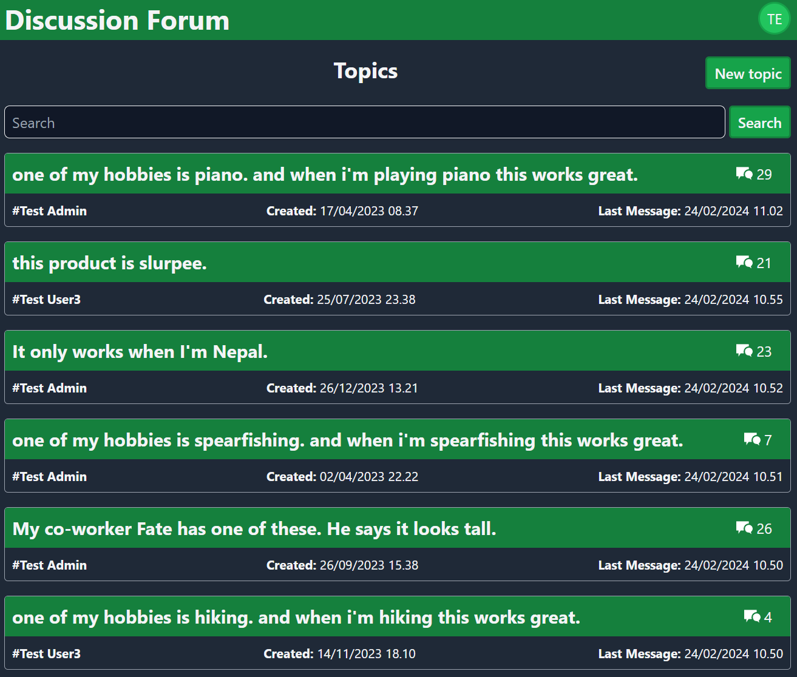
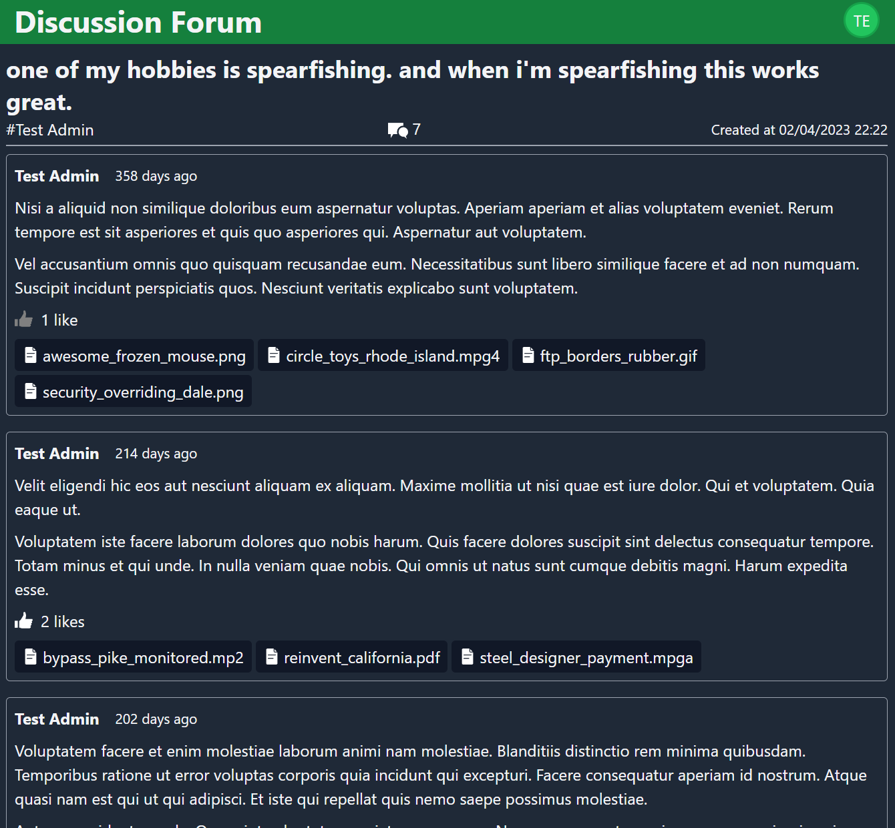

# DiscussionForum

## Description

A showcase project for Blazor in .NET 8, utilizing static server side rendering with interactive WASM components and realtime updates with SignalR.

Users can search and create topics, and when browsing a topic, new messages and upvotes are shown in real time using SignalR.

Uses SQL Server as database and Azure Blob Storage as file storage.
IAC done with Bicep.

## How to run

Run Azurite and SQL Server locally. Search functionality uses SQL Server FREETEXT function, which requires a custom Docker image, which can be found in the DiscussionForum.Tests project folder.

## Screenshots

